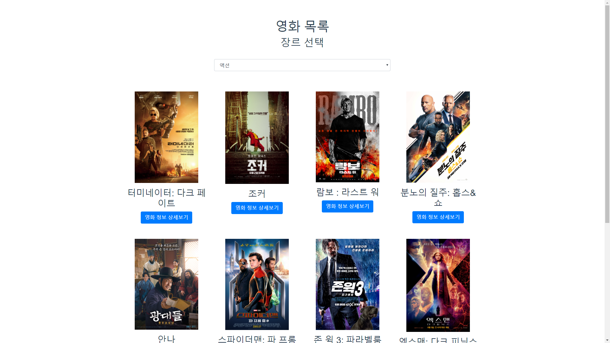

# PROJECT 09

Vue를 활용해 영화 목록 프런트엔드 구성해보기

## 완성 모습 

메인화면


카테고리 선택



모달화면


## 후기

`JSON` 정보를 axios로 요청해 가져온 정보를 토대로 영화 목록을 구성하는 프로젝트 였습니다.

가져온 데이터를 만들어 놓은 컴포넌트에 `prop`으로 전달해 주는게 핵심이었습니다.

각 컴포넌트의 관계가 굉장히 유기적으로 연결되어있기 때문에 관계를 이해하는데 어려움을 많이 겪었습니다.

### `MovieList.vue`

`props`를 설정하는 부분에서, Javascript 자체는 `[]`도 Object라고 인식하긴 하지만, Vue에서 해당 타입체크를 하는 부분에선 `Array`라고 써줘야 정확한 타입체크가 가능했습니다.

```js
...
props: {
    genres: {
      type: Array,
      required: true
    },
    movies: {
      type: Array,
      required: true
    }
  },
...
```

### `methods` vs `computed` vs `watch`

`methods` : 이벤트 리스너나, 기능적으로 동작하고 불러서 사용해야할 함수들을 정의한다.

```js
methods: {
    getSelectedMovies() {
      const genreId = this.selectedGenreId;

      this.selectedMovies = this.movies.filter(
        movie => movie.genre_id === genreId
      );
    }
  },
```

`computed` : computed에서 정의한 함수는 값을 리턴하여 `변수` 로 사용이 가능하다는 점과, 내부 변수의 변화를 감지하여 그때만 계산한다.

```js
computed: {
    computedMoviesByGenreId() {
        if (this.selectedGenreId === "default") return this.movies;
        return this.movies.filter(
        movie => movie.genre_id === this.selectedGenreId
        );
    }
}
```

`watch` : watch에서 정의한 `data`필드의 변수의 변화를 감지하고, watch ~ 해당 데이터 이름의 `handler()`를 실행한다.

```js
watch: {
    selectedGenreId: {
      handler(selectedGenreId) {
        if (selectedGenreId === "default") {
          this.selectedMovies = this.movies;
        } else {
          this.selectedMovies = this.movies.filter(
            movie => movie.genre_id === selectedGenreId
          );
        }
      },
    }
  },
```

#### 주의할점

- 컴포넌트 내에서 `v-for`와 `v-if`를 같이 쓰는건 권장되지 않는다.(린트가 뭐라함)

- `v-for`를 돌린 컴포넌트에겐 `:key` 를 주도록 한다. (권장)

- `<option>~~</option>` : 값은 `value`로 바꾸자. 